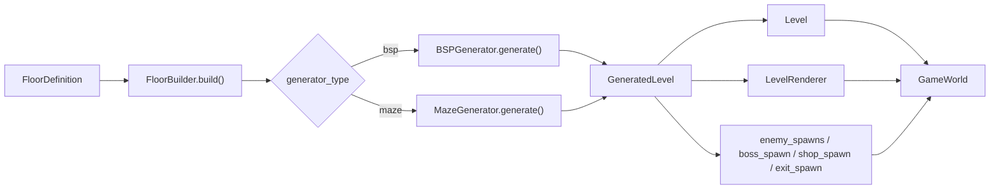
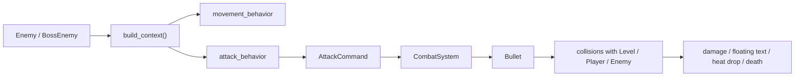

# Архитектура Qualia

Этот файл нужен как краткая карта проекта: что за что отвечает, как модули связаны между собой и по какому потоку проходит основной gameplay.

## 1. Общая схема слоев

```mermaid
flowchart TD
    Game["game.py"] --> Audio["audio_manager.py"]
    Game --> Settings["game_settings.py"]
    Game --> Title["states/title.py"]

    Title --> GameWorld["states/game_world.py"]
    Title --> SettingsMenu["states/settings_menu.py"]
    PauseMenu["states/pause_menu.py"] --> SettingsMenu

    GameWorld --> RunState["run_state.py"]
    GameWorld --> FloorBuilder["world/floor_builder.py"]
    GameWorld --> Combat["world/combat_system.py"]
    GameWorld --> Encounter["world/encounter_manager.py"]
    GameWorld --> PlayerUI["states/player_ui.py"]
    GameWorld --> DebugHUD["states/debug_hud.py"]
    GameWorld --> Camera["entities/camera.py"]
    GameWorld --> Player["entities/player.py"]
    GameWorld --> ShopKeeper["entities/shop_keeper.py"]

    FloorBuilder --> FloorDefs["world/floor_definitions.py"]
    FloorBuilder --> BSP["world/bsp_generator.py"]
    FloorBuilder --> Maze["world/maze_generator.py"]
    FloorBuilder --> Level["world/level.py"]
    FloorBuilder --> Renderer["world/level_renderer.py"]
    FloorBuilder --> Exit["entities/level_exit.py"]

    Encounter --> LayoutCache["world/room_layout_cache.py"]
    Encounter --> LockSystem["world/room_lock_system.py"]
    Encounter --> Interaction["world/world_interaction_system.py"]
    Interaction --> ShopMenu["states/shop_menu.py"]

    Combat --> Bullet["entities/bullet.py"]
    Combat --> DamageText["entities/floating_damage_text.py"]
    Combat --> Heat["entities/heat_pickup.py"]

    Enemy["entities/basic_enemy.py"] --> MoveBeh["entities/movement_behaviors.py"]
    Enemy --> AttackBeh["entities/attack_behaviors.py"]
    AttackBeh --> AttackCmd["entities/attack_command.py"]

    Boss["entities/boss_enemy.py"] --> Enemy
    Boss --> BossBeh["entities/boss_behaviors.py"]
    BossBeh --> AttackCmd
```

## 2. Основной поток игры

1. `game.py` запускает `pygame`, собирает ввод, считает `delta time` и держит `state_stack`.
2. `title.py` открывает главное меню и по кнопке `Play` создает `GameWorld`.
3. `game_world.py` через `FloorBuilder` собирает этаж, игрока, камеру, UI, магазин, выход, врагов и служебные системы.
4. Во время кадра `GameWorld` координирует движение игрока, спавн врагов в комнате, бой, двери, магазин, выход, миникарту и переходы между этажами.

## 3. Поток сборки этажа

## 4. Поток AI и боя

## 5. Поток комнатного энкаунтера

```mermaid
flowchart LR
    Player["Player enters room"] --> RoomId["RoomLayoutCache.get_room_id_for_point()"]
    RoomId --> Spawn["EncounterManager.spawn_room_enemies()"]
    Spawn --> Queue["RoomLockSystem.queue_room_lock()"]
    Queue --> Lock["RoomLockSystem._lock_room()"]
    Lock --> Doors["RoomDoor + dynamic blockers"]
    Doors --> Fight["CombatSystem removes enemies"]
    Fight --> Unlock["RoomLockSystem.unlock_room()"]
```

## 6. Карта модулей

### Core

| Файл | Роль | Основные зависимости | Кто использует |
|---|---|---|---|
| `game.py` | Точка входа, главный цикл, ввод, стек состояний | `audio_manager.py`, `game_settings.py`, `states/title.py` | Весь проект запускается отсюда |
| `constants.py` | Общие константы, размеры, цвета, enum тайлов, боевые параметры | Нет внутренних зависимостей | Почти все игровые модули |
| `audio_manager.py` | Централизованное управление музыкой и SFX | `pygame`, `game_settings.py` | `game.py`, `floor_definitions.py` |
| `game_settings.py` | Модель настроек игры | Нет | `game.py`, `audio_manager.py`, `settings_menu.py` |
| `run_state.py` | Состояние текущего забега: этаж, HP, жар, улучшения | `constants.py` | `game_world.py` |
| `settings_content.py` | Текст лора и титров | Нет | `settings_menu.py` |
| `shop_content.py` | Генерация офферов магазина и экономика цен | `math`, `random` | `game_world.py` |
| `ui_helpers.py` | Общие функции UI: шрифты, панели, кнопки, перенос текста | `pygame` | `player_ui.py`, `debug_hud.py`, `shop_menu.py`, `settings_menu.py` |
| `uis.py` | Старый простой класс кнопки для главного меню | `pygame` | `title.py` |

### States

| Файл | Роль | Основные зависимости | Кто использует |
|---|---|---|---|
| `states/state.py` | Базовый класс состояния | `game.py` по объекту `game` | Все state-модули |
| `states/title.py` | Главное меню | `GameWorld`, `SettingsMenu`, `Button` | `game.py` |
| `states/game_world.py` | Главный orchestrator игрового процесса | `RunState`, `FloorBuilder`, `CombatSystem`, `EncounterManager`, `PlayerUI`, `DebugHUD`, `Camera`, `Player` | `title.py` |
| `states/pause_menu.py` | Пауза поверх текущей игры | `SettingsMenu`, `State` | `game_world.py` |
| `states/settings_menu.py` | Меню настроек, лора и титров | `GameSettings`, `settings_content.py`, `ui_helpers.py` | `title.py`, `pause_menu.py` |
| `states/shop_menu.py` | Меню магазина | `State`, `ui_helpers.py` | `world_interaction_system.py` |
| `states/debug_hud.py` | Отладочное окно поверх игры | `ui_helpers.py` | `game_world.py` |
| `states/player_ui.py` | Постоянный HUD игрока и миникарта | `ui_helpers.py` | `game_world.py` |
| `states/game_over.py` | Экран поражения | `State` | `game_world.py` |
| `states/game_victory.py` | Экран победы | `State` | `game_world.py` |

### World

| Файл | Роль | Основные зависимости | Кто использует |
|---|---|---|---|
| `world/floor_definitions.py` | Декларативное описание этажей | `MusicTrack`, классы врагов и босса | `game_world.py`, `floor_builder.py` |
| `world/floor_builder.py` | Собирает runtime-этаж из `FloorDefinition` | `BSPGenerator`, `MazeGenerator`, `Level`, `LevelRenderer`, `LevelExit` | `game_world.py` |
| `world/bsp_generator.py` | Генерация обычных этажей BSP + BFS-валидация | `constants.py` | `floor_builder.py`, частично `maze_generator.py` |
| `world/maze_generator.py` | Генерация лабиринтного этажа DFS + BFS-дистанции | `constants.py`, `GeneratedLevel` | `floor_builder.py` |
| `world/level.py` | Модель карты: тайлы, коллизии, line of sight, dynamic blockers | `constants.py` | `floor_builder.py`, `combat_system.py`, `player.py`, `basic_enemy.py` |
| `world/level_renderer.py` | Отрисовка тайлов карты | `pygame` | `floor_builder.py`, `game_world.py` |
| `world/combat_system.py` | Пули, урон, хит-детект, всплывающий урон, дропы | `Bullet`, `FloatingDamageText`, `HeatPickup` | `game_world.py` |
| `world/encounter_manager.py` | Координирует комнатные энкаунтеры | `RoomLayoutCache`, `RoomLockSystem`, `WorldInteractionSystem` | `game_world.py` |
| `world/room_layout_cache.py` | Кэш прямоугольников комнат, tile->room lookup, спецификаций дверей | `RoomDoor` | `encounter_manager.py`, `room_lock_system.py` |
| `world/room_lock_system.py` | Pending-lock и active-lock комнаты, двери, блокеры | `RoomLayoutCache`, `Level` | `encounter_manager.py` |
| `world/world_interaction_system.py` | Взаимодействие с выходом и торговцем | `ShopMenu` | `encounter_manager.py` |

### Entities и AI

| Файл | Роль | Основные зависимости | Кто использует |
|---|---|---|---|
| `entities/player.py` | Игрок: движение, HP, dodge, получение урона | `constants.py`, `Level` | `game_world.py`, `combat_system.py` |
| `entities/camera.py` | Камера: смещение, clamp, zoom, world/screen conversion | `pygame` | `game_world.py`, render-методы сущностей |
| `entities/bullet.py` | Базовая пуля игрока и врагов, включая рикошет | `constants.py` | `combat_system.py` |
| `entities/floating_damage_text.py` | Всплывающие числа урона | `pygame` | `combat_system.py` |
| `entities/heat_pickup.py` | Подбираемая валюта `жар` | `constants.py` | `combat_system.py` |
| `entities/level_exit.py` | Выход с этажа | `pygame` | `floor_builder.py`, `world_interaction_system.py`, `game_world.py` |
| `entities/shop_keeper.py` | Торговец, триггер магазина | `pygame` | `game_world.py`, `world_interaction_system.py` |
| `entities/room_door.py` | Временные двери комнаты и их анимация | `pygame` | `room_layout_cache.py`, `room_lock_system.py` |
| `entities/basic_enemy.py` | Базовый враг: HP, LOS, память цели, контекст, движение и атака | `constants.py`, `Level`, `Player` | Все обычные враги, `boss_enemy.py` |
| `entities/movement_behaviors.py` | Стратегии движения врагов | `pygame` | `basic_enemy.py`, подклассы врагов, `boss_behaviors.py` |
| `entities/attack_behaviors.py` | Стратегии атак обычных врагов | `AttackCommand`, `constants.py` | Подклассы врагов |
| `entities/attack_command.py` | Data-объект атаки между AI и `CombatSystem` | `pygame` | `attack_behaviors.py`, `boss_behaviors.py`, `combat_system.py` |
| `entities/boss_behaviors.py` | Фазы босса, паттерны атак и движения | `AttackCommand` | `boss_enemy.py` |
| `entities/boss_enemy.py` | Босс как особый враг с фазами | `basic_enemy.py`, `boss_behaviors.py` | `floor_definitions.py`, `encounter_manager.py` |
| `entities/orange_eye_enemy.py` | Обычный ranged-враг | `Enemy`, `ChaseMovement`, `SingleShotAttack` | `floor_definitions.py` |
| `entities/blue_eye_enemy.py` | Враг с рикошетящими пулями | `Enemy`, `ChaseMovement`, `RicochetShotAttack` | `floor_definitions.py` |
| `entities/heart_enemy.py` | Враг с волновой атакой / stationary logic | `Enemy`, `IdleMovement`, `HeartAttack` | `floor_definitions.py` |
| `entities/prism_enemy.py` | Снайпер-враг | `Enemy`, `KeepDistanceMovement`, `SniperAttack` | `floor_definitions.py` |
| `entities/teeth_enemy.py` | Shotgun-враг | `Enemy`, `KeepDistanceMovement`, `ConeShotAttack` | `floor_definitions.py` |

## 7. Самые важные зависимости, которые стоит запомнить

1. `game.py -> Title -> GameWorld` — главный вход в игру.
2. `GameWorld -> FloorBuilder -> BSP/Maze -> Level` — сборка конкретного этажа.
3. `GameWorld -> EncounterManager -> RoomLockSystem` — логика закрывающихся комнат.
4. `GameWorld -> CombatSystem -> Bullet` — весь бой и столкновения.
5. `Enemy -> attack_behavior -> AttackCommand -> CombatSystem` — архитектура атак врагов.
6. `Enemy -> build_context() -> movement_behavior / attack_behavior` — архитектура принятия решений врага.
7. `PlayerUI <- GameWorld` — HUD ничего не решает сам, он только рисует состояние мира.
8. `SettingsMenu -> GameSettings` и `AudioManager -> GameSettings` — настройки отделены от конкретного меню.
